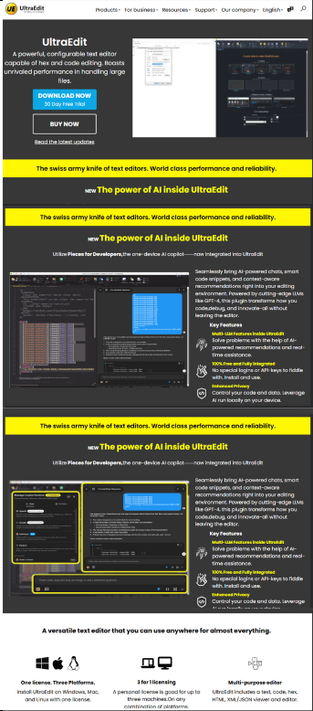
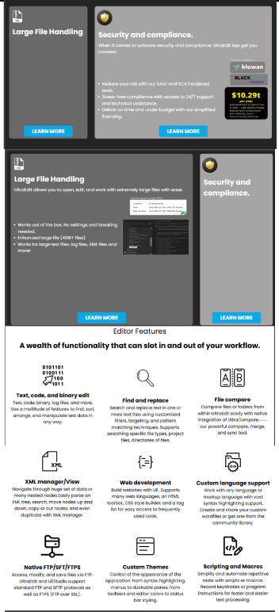
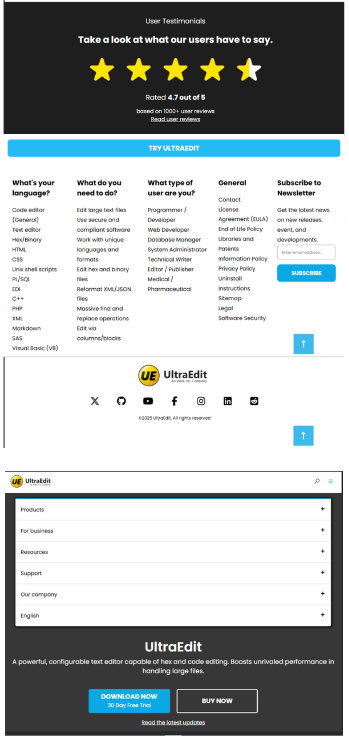

# 🚀 UltraEdit Text Editor Clone  

  
  
  

## 📌Project Overview  
This project is a **fully responsive and interactive** clone of the **UltraEdit text editor**, developed using **HTML, CSS, and JavaScript**. The goal is to replicate the **core UI and basic functionalities** of UltraEdit while continuously improving the project with new features.  

## ✨ Features  
✅ **Responsive UI** – Adapts to different screen sizes  
✅ **Interactive Layout** – Smooth user experience with modern styling  
✅ **Basic Text Editing** – Initial text handling features  
✅ **Ongoing Enhancements** – More functionalities being added  

## 🔧 Tech Stack  
- **Frontend:** HTML, CSS, JavaScript  

## 🚀 Upcoming Features  
🔹 **Dark mode & customizable themes**  
🔹 **Keyboard shortcuts for faster editing**  
🔹 **Advanced text editing capabilities**  
🔹 **File handling & saving options**  

## 📽️ Project Demo  
### 🎥 Watch on YouTube  
[](https://youtu.be/WqLkCP5KR40)

## 📂 Installation & Usage  
1. Clone this repository:  
   ```bash
   git clone https://github.com/M-Meeran-Siddiqui/UltraEdit-Text-Editor-Clone.git
